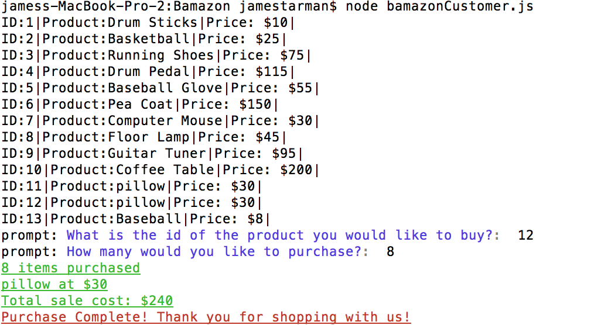
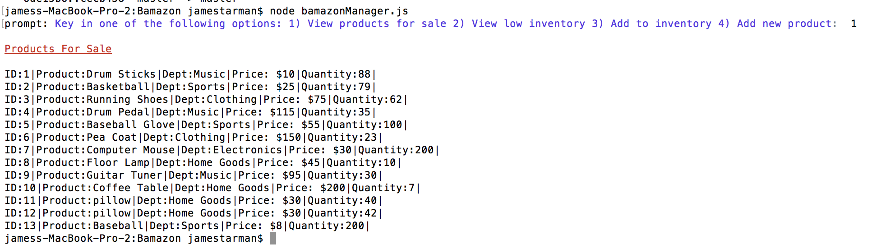
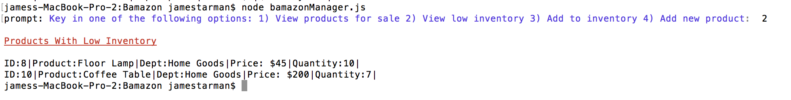
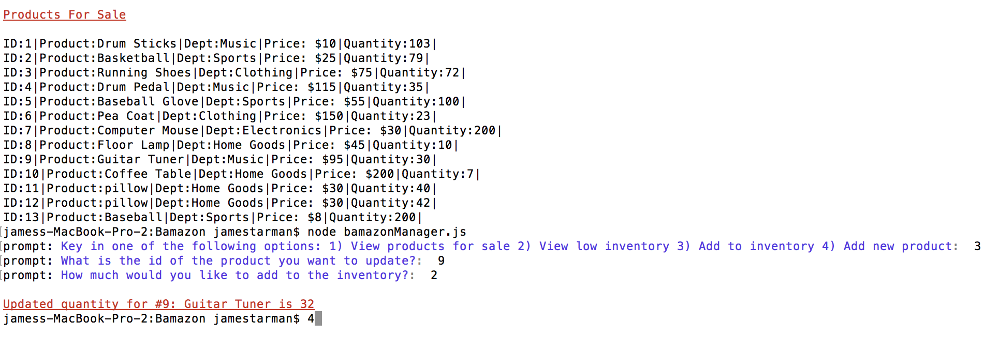
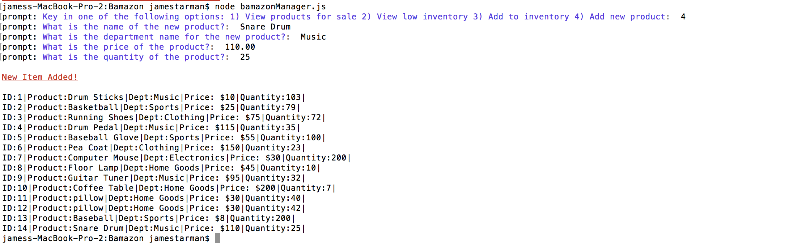

# Bamazon
# Overview
Bamazon is a command line application that uses the SQL database. There are two command options, customer or manager. The customer can buy products from the store, while the manager has four different options.

## Bamazon Customer Option

When run the customer will see a list of products available to buy and then be asked to select a product by it's id number. Then they will be asked how many of the product they would like to buy. Once they select, it will show the total amount of which product they bought and the cost of the total sale. The products database will update to reflect inventory change.

## Bamazon Manager Option

When run the manager will have four options:

1. View products for sale
1. View low inventory
1. Add to inventory
1. Add new product

### Option 1

This shows all products

### Option 2

This shows all items with low inventory (below 15 units)

### Option 3

This allows the manager to add new inventory to a selected product

### Option 4

This allows the manager to add a new item into the table

## Technologies Used

* Javascript
* NodeJS
* MySQL
* npm packages:
	* mysql
	* prompt
	* colors

