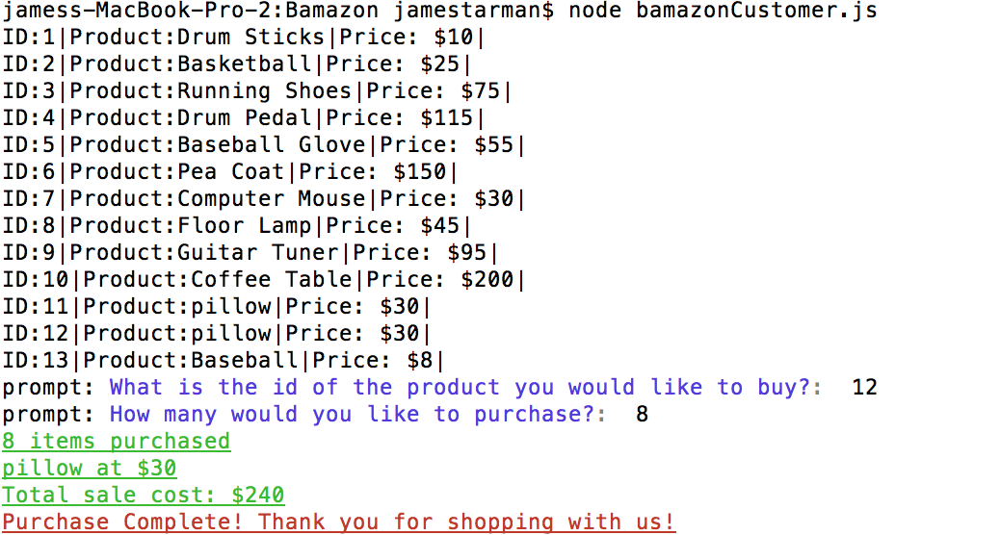

# Bamazon
# Overview
Bamazon is a command line application that uses the SQL database. There are to command options, customer or manager. The customer can buy products from the store, while the manager has four different options.

## Bamazon Customer Option

When run the customer will see a list of products available to buy and then be asked to select a product by it's id number. Then they will be asked how many of the product they would like to buy. Once they select, it will show the total amount of which product they bought and the cost of the total sale. The products database will update to reflect inventory change.

